下記の動画が解りやすかったので参考にしました。

> **参照動画**: [ホワイトハッカー入門 #0 【2025年最新】ハッキングラボ構築 KaliLinux（YouTube）](https://youtu.be/KYFRYNvgG_4?si=Ky9-3ulygHt0QMGT)


## 概要
- 目的：ローカルで安全にハッキングの練習ができるラボを作る。
- 主な構成：ホストOS（Windows 11） + VirtualBox + Kali Linux
- 時間目安：約1時間（環境やダウンロード速度に依存）。


## セキュリティと法的注意
- **このラボはローカル内で完結させること。** インターネット経由で脆弱なVMが外部に公開されないよう設定を確認してください。
- 実在する第三者のシステムを、同意や許可なく攻撃しないこと（違法）。

## 構築手順

### 1. VirtualBoxのインストール
- https://www.virtualbox.org/wiki/Downloads にアクセス
- Windows hosts をクリックしインストーラーをダウンロード
  
- Accept and download をクリックしExtension Packもダウンロード
  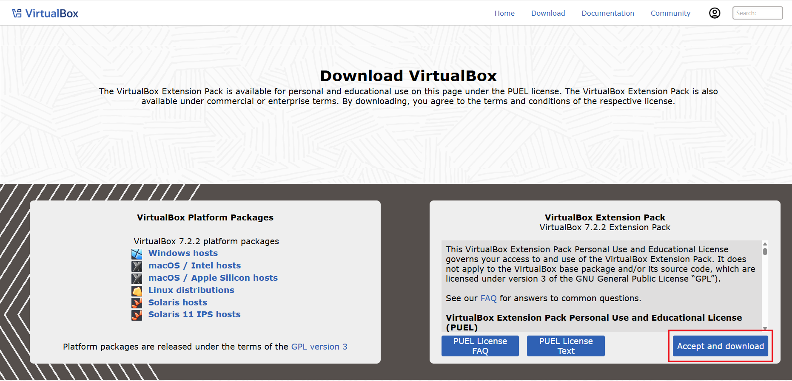
- ダウンロードした VirtualBox-7.2.2-170484-Win.exe を実行
- VirtualBoxを起動しExtension Packもインストール
  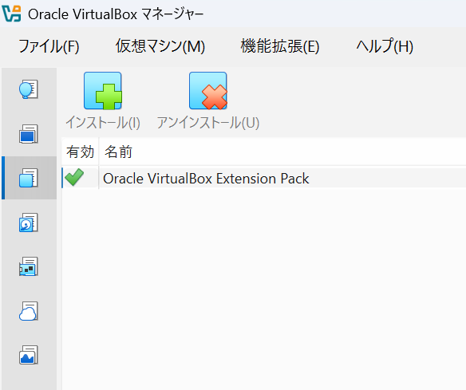

### 2. Kali Linux のtorrentファイルをダウンロード
- https://www.kali.org/get-kali/#kali-platforms にアクセス
- Virtual Machines をクリック
  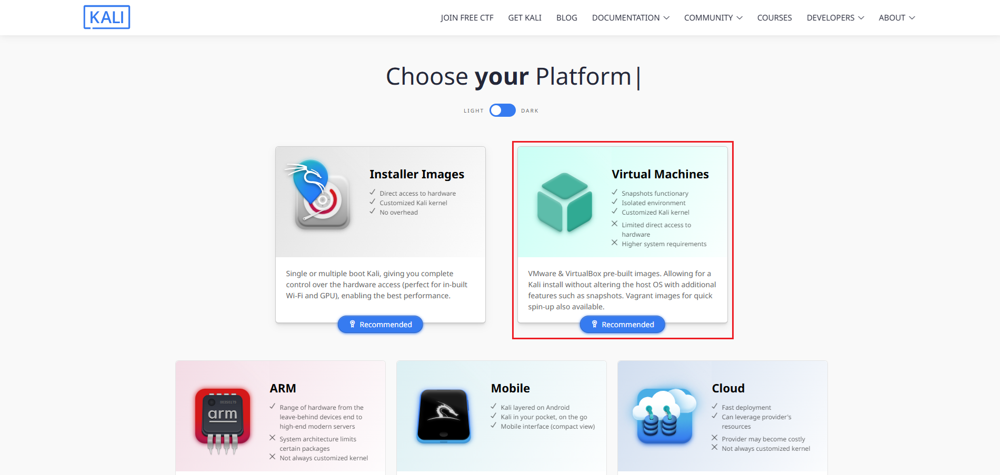
- VirtualBoxのtorrent をクリックし kali-linux-2025.3-virtualbox-amd64.7z.torrent をダウンロード
  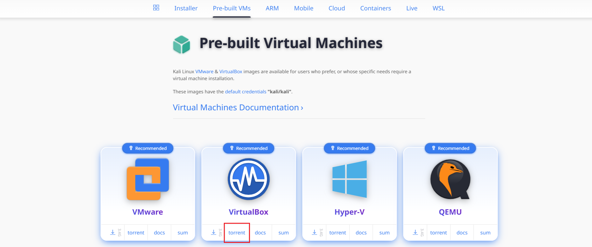

### 3. uTorrentのインストール
- https://www.utorrent.com/intl/ja/downloads/win/ にアクセス
- uTorrent Classicの無料ダウンロード をクリック
  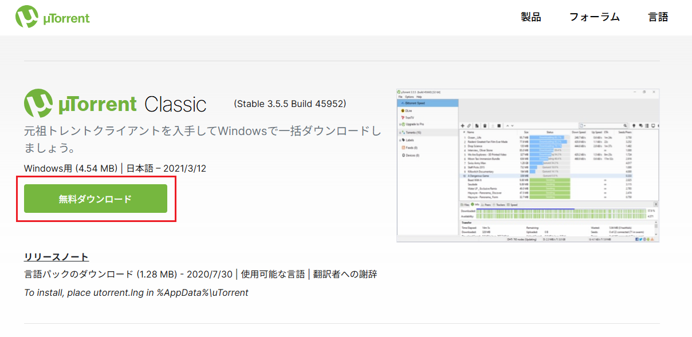
- ダウンロードした utorrent_installer.exe を実行
- Avast は Skip All をクリック
- Choose Install Options はすべてチェックを外しました(お好みで)

### 4. Virtual Disk Imageのダウンロード
- kali-linux-2025.3-virtualbox-amd64.7z.torrent をダブルクリック
- uTorrentが起動するので OK をクリック
- ダウンロードが完了し状態が シード中 となるまで待つ
- シード中 となったら、ファイルを右クリックし 停止 をクリック

:::message
**シード中 とは**
自分のPCがすでにファイルのダウンロードを完了し、そのファイルを他のユーザーにアップロード（共有）している状態を指します。
自分が「提供者」となり、他の人がそのファイルをダウンロードできるように手助けしている状態です。
:::

### 5. uTorrentのアンインストール
:::message alart
uTorrentが常時シード状態となることや、アプリをアップデートしないまま放置して攻撃者に悪用されることを防ぐために、使用しない場合はアンインストールすることをおすすめします。
:::

- 設定→アプリ→インストールされているアプリ を開く
- uTorrentをアンインストール
　※設定内容を削除する にチェックを入れる

### 6. Virtual Disk Imageの展開
- ダウンロードした kali-linux-2025.3-virtualbox-amd64.7z を展開する

:::message alart
Windows標準機能では.7zファイルを扱えずエラーとなるため、7-zipを使用しました
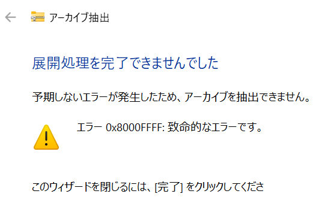
*致命的なエラー*
:::

### 7. VirtualBoxに仮想マシン(Kali Linux)を追加する
- Oracle VirtualBoxマネージャー を開く
- 開く をクリック

- 展開した kali-linux-2025.3-virtualbox-amd64.vbox を開く
- 取り込まれたマシンの 設定 をクリック

- 任意の名前に変更する

- 環境に合わせてメインメモリー、プロセッサー数、ストレージサイズを調整
　今回は、
　　**メインメモリー:**4096MB
　　**プロセッサー数:**2
　　**ストレージの仮想的なサイズ:**80GB
　とした

:::message
**(参考)chatGPTさんが示した推奨設定表**(根拠は下部を参照)
| ホスト (RAM / CPU) | Kali RAM | Kali CPU |         Disk |
| --------------: | -------: | -------: | -----------: |
|       8GB / 4コア |      2GB |      1コア |     20GB SSD |
|    16GB / 4–8コア |      4GB |      2コア |  30–40GB SSD |
|      32GB / 8コア |   8–12GB |      4コア | 50–100GB SSD |

1️⃣ Kali Linux 側の要件（公式ドキュメント）
Kali Linux 公式サイトでは以下を最低要件として提示しています：
- RAM: 最低 2GB、推奨 4GB 以上（GUI使用時）
- CPU: 1コアで動作可能、ただし並列処理やBurpなどGUIツール利用では 2コア以上推奨
- ディスク: 最低 20GB（推奨は 50GB 以上、ツール群をインストールするならさらに余裕が必要）
👉 これが「下限の基準」

2️⃣ VirtualBox の推奨設定
VirtualBox のマニュアルや公式フォーラムでは：
- ホストの 物理RAMの 50% を超えない 割当が安定運用の目安
- CPUコアは ホスト総コア −1 を上限 にするべき（ホスト側に最低1コア残すため）
- ストレージは 可変サイズVDIでも、最低サイズは20GB以上 にするのが無難
👉 これが「ホストに余裕を残す必要性」の裏付け

3️⃣ 実運用の体感知見（セキュリティ演習ラボでのよくあるケース）
- RAM 2GB: CLI中心や軽いnmapなら動くが、Burp Suiteやブラウザを開くとすぐに足りなくなる
- RAM 4GB: GUIツール・ブラウジング・Wiresharkまで快適に動作（標準ライン）
- RAM 8GB 以上: Docker や複数ツールを並列実行しても余裕
- CPU 1コア: CLI中心ならOK
- CPU 2コア: GUIやマルチタスクで体感速度が大幅に改善
- CPU 4コア以上: 複数の重いツールを同時に動かす場合のみ恩恵あり
👉 これを踏まえて「8GBホストなら Kaliは2GB」「16GBホストなら4GB」といった設定とした

4️⃣ ディスクの根拠
- Kali ISO自体は数GBですが、ツールをapt経由でインストールすると 数十GB単位で増える
- 20GB: 最小限（かなりカツカツ）
- 30–40GB: 標準的なツールセットを揃えるのに安心
- 50GB以上: 追加でDockerやログ保存をする場合の安全圏

✅ まとめ
- 公式最小要件 = Kaliは「2GB RAM, 1コア, 20GB」で動く
- VirtualBoxの制約 = ホストの半分以上のRAMは割り当てない / CPUは1コア残す
- 実運用知見 = GUIツールを使うと実際には「4GB+ RAM / 2コア+」ないと厳しい
- ディスク利用実態 = 20GBは最低限、30–50GBが現実的
👉 この3本を掛け合わせて「8GBホストなら2GB / 16GBホストなら4GB / 32GBホストなら8–12GB」という表としている
:::

- ネットワークのアダプター1が NAT であることを確認

:::message
デフォルト設定は、
**Username:**kali
**Password:**kali
:::

### 8. 仮想マシン(Kali Linux)のチューニング
- 日本語キーボードの設定
 1.左上のメニューボタン→Usual Applications→Settings→Keyboard をクリック
 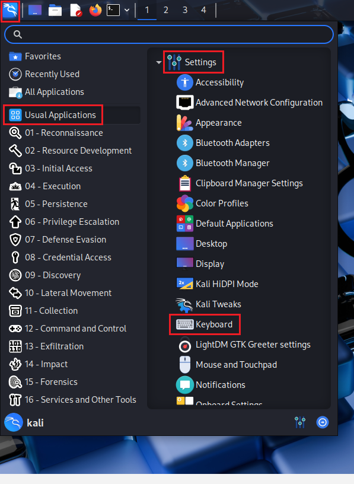
 2.Layout タブをクリック
 
 3.Use system defaults をオフにする
 
 4.+Add をクリック
 
 5.Japanese を選択し OK をクリック
 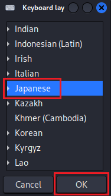
 6.Japanese を選択後 ↑ をクリックし、Japaneseを一番上に移動する
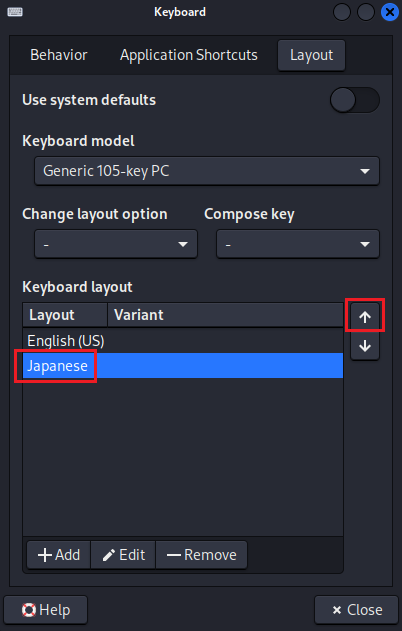
 7.使用しないキーボードレイアウトを選択後 -Remove をクリックし削除
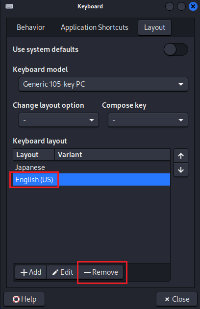
 8.Use system defaults をオンにする
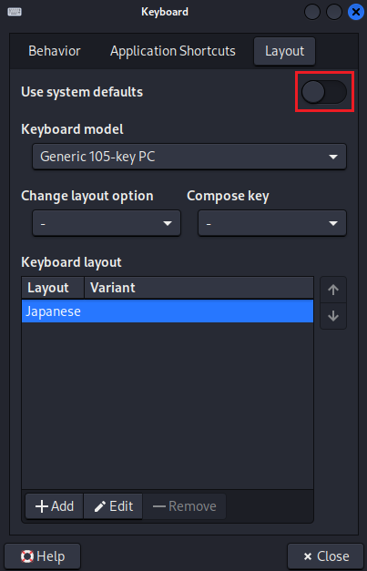
 9.ポップアップ画面で OK をクリック
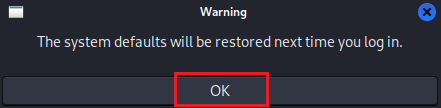
 10.×close をクリック
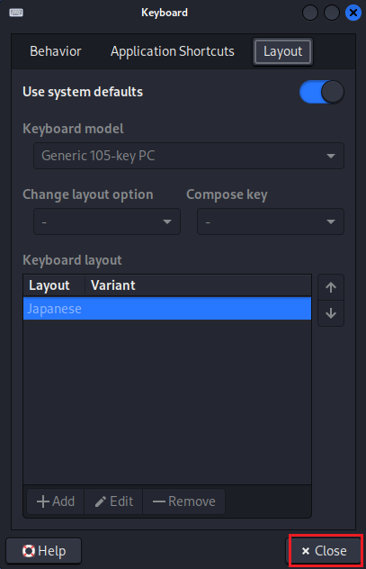

- TimeZoneの設定
 1.画面右上の時計を右クリック後 Properties をクリック
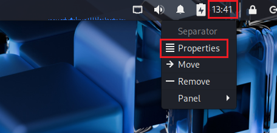
 2.Time and Date Settings をクリック

 3.Unlock をクリック
 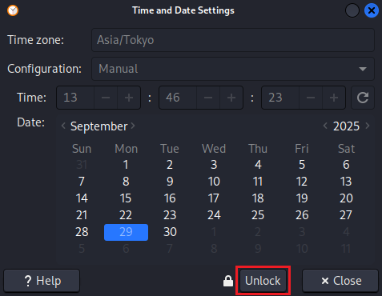
 4.パスワードを入力後 Authenticate をクリック
 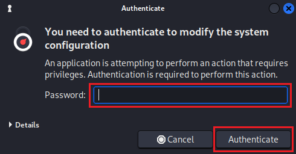
 5.Time Zone設定値をクリック
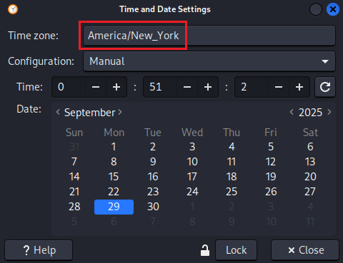
 6.Asia/Tokyo を選択後 ×Close をクリック
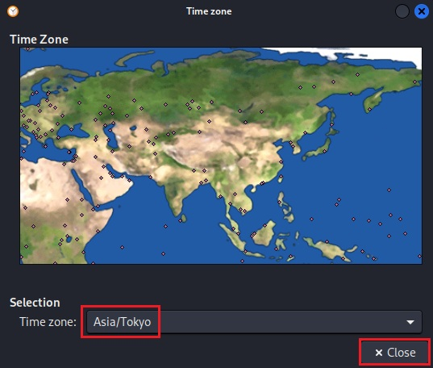
 7.×Close をクリック
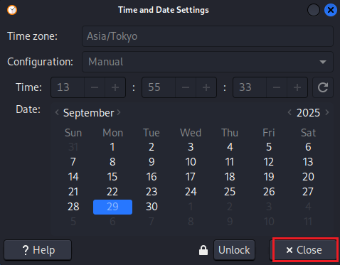
 8.×Close をクリック
 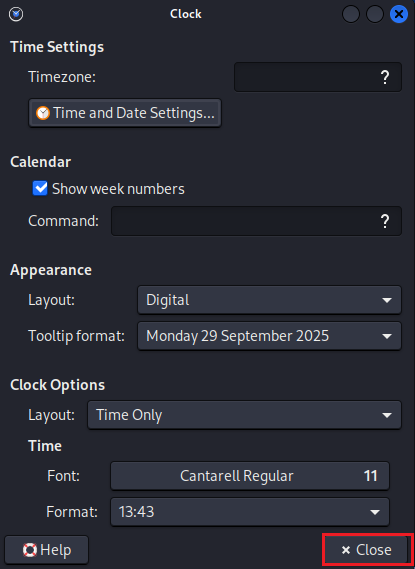
- 
 1.左上のメニューボタン→Usual Applications→Settings→Power Manager をクリック
 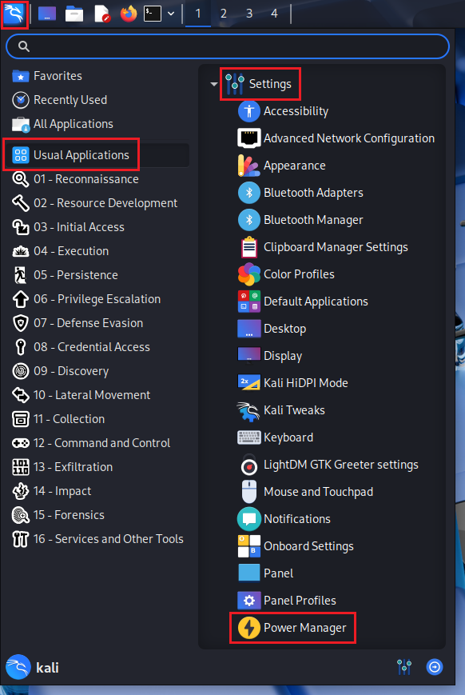
 2.Systemタブ をクリック
 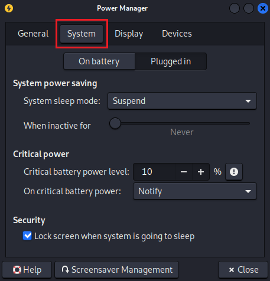
 3.When inactive for を Never にする(On battery、Plugged in共に)
 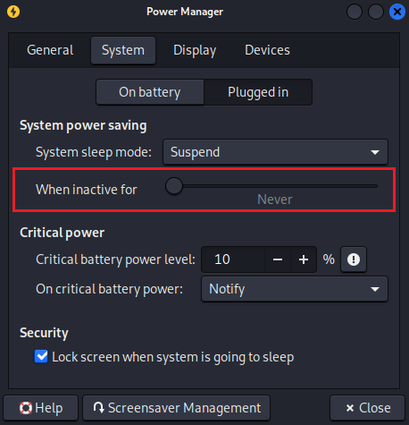
 4.Displayタブ をクリック
 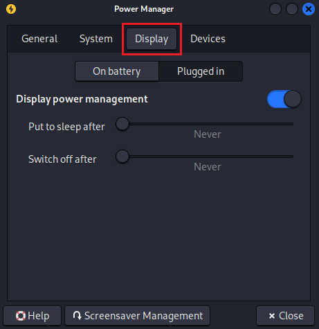
 5.Put to sleep after、Switch off after を Never にする(On battery、Plugged in共に)
 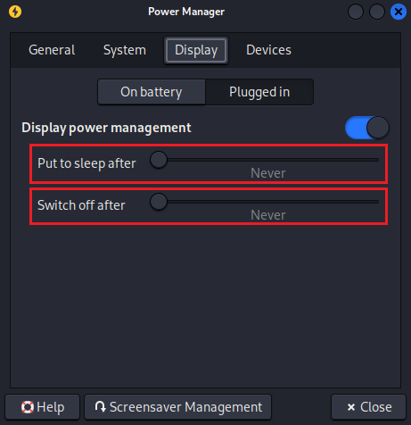
 6.×Close をクリック
 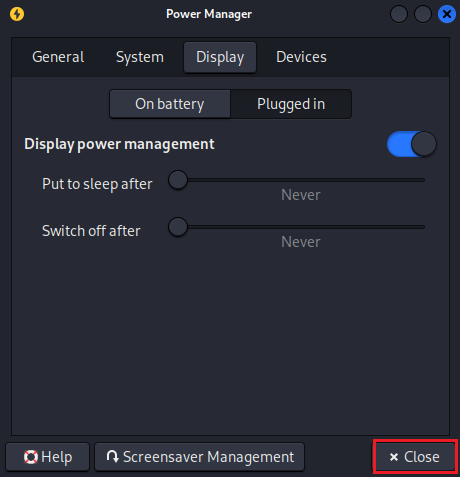
- システムパッケージの更新
 1.左上の Terminal Emulatorアイコン をクリック
 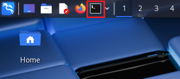
 2.以下のコマンドを実行
 ```
 sudo apt update
 ```
 3.実行が完了し下記メッセージが表示されることを確認
 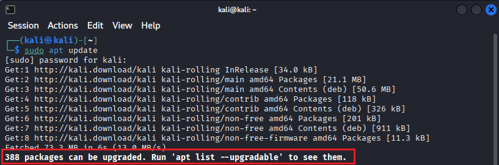
 4.以下のコマンドを実行
 ```
 sudo apt -y upgrade
 ```
 5.コマンドの実行が完了したことを確認
 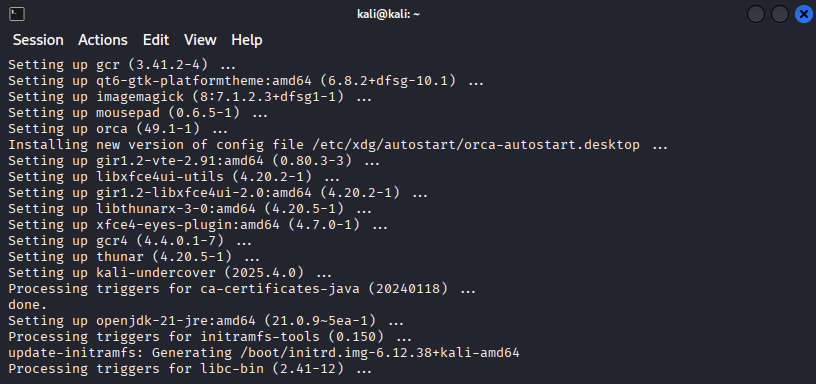


**以上でハッキングラボ構築終了！**